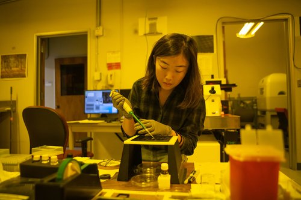

Investigadores de Caltech han desarrollado una nueva técnica de fabricación para imprimir piezas metálicas de tamaño microscópico con características similares a las de tres o cuatro hojas de papel. Ahora, han reinventado esta técnica para imprimir objetos mucho más pequeños, de tan solo 150 nanómetros, comparable al tamaño de un virus de la gripe. Durante este proceso, se descubrió que la organización atómica de estos objetos es desordenada, lo cual afectaría negativamente a la calidad de los materiales a gran escala. Sin embargo, en el caso de los objetos metálicos a escala nanométrica, este desorden a nivel atómico los hace más fuertes que estructuras más ordenadas de tamaño similar.

El trabajo fue llevado a cabo en el laboratorio de Julia R. Greer, catedrática de Ciencia de los Materiales, Mecánica e Ingeniería Médica. La nueva técnica es una versión mejorada de una anunciada por el equipo el año pasado, pero adaptada para funcionar a nanoescala. Sin embargo, esto presenta un desafío adicional, ya que los objetos fabricados no son visibles a simple vista y tampoco son fácilmente manipulables.

El proceso comienza con la preparación de un compuesto fotosensible que se utiliza como "cóctel" para la impresión. En lugar de utilizar máscaras fotográficas o luz láser, se utilizan haces de electrones para exponer y endurecer la resina en la forma deseada. Después de que se realiza la impresión, se realiza un tratamiento térmico para eliminar el exceso de aditivos y lograr la cristalización del metal a escala atómica.

Los investigadores han demostrado la eficacia de esta técnica imprimiendo en 3D una red de nanopoliedros de níquel y se ha observado que son mucho más fuertes que sus contrapartes de tamaño mayor. Esta técnica podría tener aplicaciones en la fabricación de nanosensores, componentes electrónicos y otros dispositivos pequeños de alta resistencia.

https://www.caltech.edu/about/news/technique-for-3-d-printing-metals-at-the-nanoscale-reveals-surprise-benefit