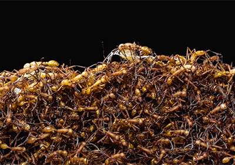

Contar hormigas es como contar granos de arena en la playa. Pero seis investigadores han
demostrado que estaban preparados para la tarea. Han dado con la última y más completa
estimación del número de hormigas en el mundo: 20 cuatrillones. Es decir, 12
megatoneladas de biomasa, más que todas las aves y mamíferos salvajes juntos.

Las hormigas son importantes ingenieras del ecosistema: mueven la tierra, distribuyen
semillas y reciclan la materia orgánica. Se ha investigado cómo se distribuyen las hormigas
por el mundo, pero no había una estimación global de cuántas hay.

Así que para el trabajo, los investigadores peinaron 12.000 informes de bases de datos en
muchos idiomas, incluidos el búlgaro y el indonesio, y encontraron 489 estudios con
métodos de recogida y recuento de hormigas lo suficientemente rigurosos como para ser
incluidos. 

La mayoría de los estudios no se centraban en las hormigas en sí, sino en
cuestiones más amplias de biodiversidad y evolución, y casualmente tomaban muestras de
hormigas. Al equipo le sorprendió la concentración de hormigas en los trópicos, donde
abundan sobre todo en sabanas y bosques húmedos.

La nueva estimación es entre dos y veinte veces superior a las anteriores, según informa
hoy el equipo en la revista Proceedings of the National Academy of Sciences. Sin embargo,
los autores afirman que es probablemente más precisa porque es la primera vez que se
realiza un recuento ascendente de hormigas capturadas en todo el mundo.

Para más información, pueden leer el artículo de Science en
https://www.science.org/content/article/how-many-ants-live-earth