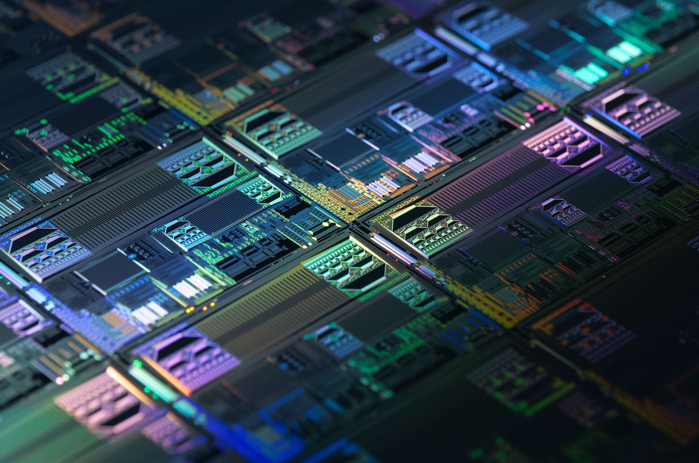

Australia ha decidido invertir 940 millones de dólares australianos (unos 620 millones de dólares) en la empresa emergente PsiQuantum, con el objetivo de construir un ordenador cuántico funcional. La empresa utilizará fotones como bits cuánticos o qubits para codificar la información, en lugar de utilizar átomos, iones o circuitos de metal superconductor como la mayoría de los enfoques actuales de la computación cuántica.

Esta apuesta por la tecnología cuántica es arriesgada, según indica Raymond Laflamme, un físico teórico de renombre. Sin embargo, Cathy Foley, jefa científica de Australia, considera que vale la pena. El objetivo del proyecto es colocar a Australia en la vanguardia de la carrera mundial por desarrollar el primer ordenador cuántico útil. Foley afirma que es necesario actuar ahora, para no quedarse atrás.

Australia cuenta con fortalezas en teoría cuántica y fotónica, y dos de los fundadores de PsiQuantum son australianos. De acuerdo con Irfan Siddiqi, un físico de la Universidad de California en Berkeley, este enfoque permite a Australia tratar de aprovechar su ventaja única en el campo de la computación cuántica.

Un ordenador cuántico funcional podría resolver problemas que superan la capacidad de cualquier superordenador convencional. Por lo tanto, invertir en esta tecnología representa una oportunidad para alcanzar avances significativos y liderar la industria. Si bien existen riesgos, Australia considera que los beneficios y el potencial son suficientemente altos como para justificar esta inversión.

En resumen, Australia ha decidido invertir un gran monto de dinero en la empresa PsiQuantum, con el objetivo de desarrollar y construir un ordenador cuántico funcional. Este enfoque utiliza fotones como bits cuánticos y aprovecha las fortalezas de Australia en teoría cuántica y fotónica. Aunque esta inversión representa un riesgo, las autoridades australianas consideran que es una apuesta que vale la pena, ya que permitirá a Australia liderar la carrera mundial en la construcción de un ordenador cuántico útil.