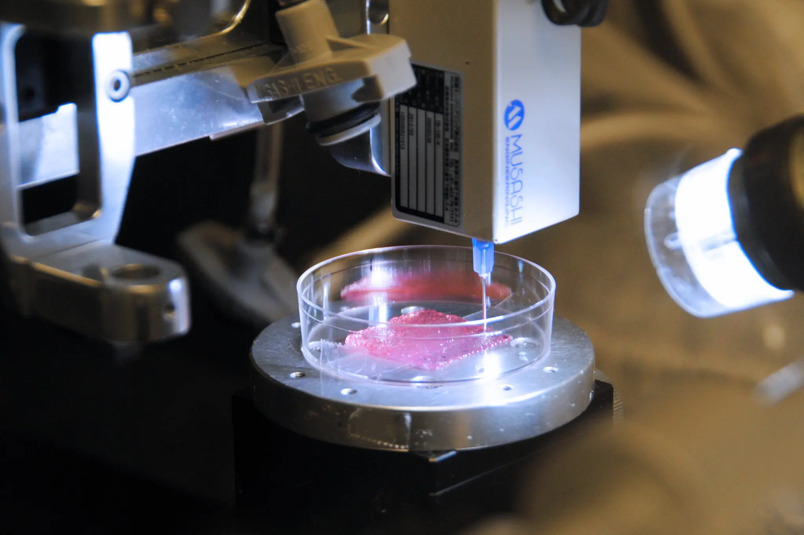

En la mitología griega, Prometeo, el dios del fuego, tuvo la tarea de crear al ser humano, moldeando el cuerpo humano y sus órganos a partir del barro. Ahora, a través de la ciencia, una versión del logro de Prometeo puede estar convirtiéndose en realidad.

Catorce horas después de entrar en cirugía, el niño de 10 años Luke Massella despertó en el Hospital Infantil de Boston. Luke nació con una condición llamada espina bífida, una enfermedad espinal que puede causar complicaciones de salud de gran alcance. A los 10 años, había pasado por más de una docena de cirugías, y en 2001, un problema en la vejiga provocó insuficiencia renal. Luke necesitaba una nueva vejiga; sin embargo, tradicionalmente, esto no era posible. Anteriormente, el fallo de la vejiga significaba vivir con una bolsa de ostomía que recoge la orina fuera del cuerpo o una bolsa interna drenada con un tubo. Además, sin una vejiga sana, los riñones de Luke nunca podrían sanar.

"Estaba enfrentando la posibilidad de tener que hacer diálisis [purificación de la sangre a través de una máquina] por el resto de mi vida", dijo Luke. "No podría jugar deportes y tener una vida normal de niño con mi hermano". El Dr. Anthony Atala, un pediatra urólogo pionero, tenía otras ideas.

Usando impresoras 3D especializadas y un pequeño trozo de la vejiga de Luke, el equipo del Dr. Atala, durante dos meses, pudo hacer crecer una nueva vejiga para Luke. La cirugía de trasplante fue un éxito abrumador. Hasta el día de hoy, Luke vive sin complicaciones; el primer caso de un trasplante de órgano impreso en 3D. Para 2018, otros nueve pacientes habían recibido trasplantes de órganos impresos de manera similar.

Las bioimpresoras funcionan de manera similar a las impresoras 3D tradicionales; sin embargo, en lugar de depositar capas de plástico, entregan capas de biomaterial que incluye células vivas. Estas células vivas se cultivan a partir de células madre tomadas del paciente y se cultivan para formar una bio tinta. Las impresoras siguen instrucciones de modelos de computadora detallados de órganos u otros tejidos que a menudo se hacen específicamente para un paciente determinado. Así, mediante el uso de una resonancia magnética y células cosechadas, las impresoras pueden fabricar un órgano personalizado, proporcionando una coincidencia perfecta.

A través de la bioimpresión, la ciencia está dando vida a la mitología. Esta vez, sin embargo, en lugar de titanes dando forma a elementos del cuerpo humano a partir del barro, investigadores y médicos están imprimiendo órganos usando equipos de alta tecnología, guiándonos hacia un futuro más saludable.

Para más información, pueden leer el artículo de The New Yorker en
https://www.nytimes.com/2023/04/13/learning/3-d-bioprinting-a-modern-day-prometheus.html