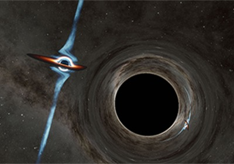

Un agujero negro supermasivo situado a 9.000 millones de años luz parece tener un agujero
negro compañero orbitando a su alrededor. A medida que la órbita se reduce, la pareja está
más cerca de fusionarse.

Los agujeros negros supermasivos, cuya masa es de millones a miles de millones de veces
la de nuestro Sol, se encuentran en el corazón de la mayoría de las galaxias.
El par se fusionará en unos 10.000 años. Eso puede parecer mucho tiempo, pero los
agujeros negros de este tamaño tardarían en total unos 100 millones de años en empezar a
orbitar el uno al otro y finalmente unirse. Así que este par está a más del 99% del camino
hacia la colisión.

Los astrónomos llaman blazares a los agujeros negros supermasivos con chorros
orientados hacia la Tierra, y un blazar llamado PKS 2131-021 es el centro de este reciente
artículo.

Situado a unos 9.000 millones de años luz de la Tierra, PKS 2131-021 es uno de los 1.800
blazares que un grupo de investigadores del Caltech en Pasadena ha estado monitorizando
con el Radio Observatorio del Valle de Owens, en el norte de California, durante 13 años
como parte de un estudio general del comportamiento de los blazares.

Los investigadores creen ahora que esta variación regular es el resultado de un segundo
agujero negro que tira del primero cuando se orbitan mutuamente cada dos años. Se
calcula que cada uno de los dos agujeros negros de PKS 2131-021 tiene unos cientos de
millones de veces la masa de nuestro Sol. Para confirmar el hallazgo, los científicos tratarán
de detectar ondas gravitacionales - ondas en el espacio - procedentes del sistema. La
primera detección de ondas gravitacionales procedentes de agujeros negros binarios se
anunció en 2016.

Para confirmar que las oscilaciones no eran aleatorias o la causa de un efecto temporal
alrededor del agujero negro, el equipo tuvo que buscar más allá de la década (2008 a 2019)
de datos del Observatorio del Valle de Owens. Tras saber que otros dos radiotelescopios
también habían estudiado este sistema -el Observatorio de Radio de la Universidad de
Michigan (1980 a 2012) y el Observatorio Haystack (1975 a 1983)-, indagaron en los datos
adicionales y descubrieron que coincidían con las predicciones sobre cómo debería cambiar
el brillo del blazar con el tiempo.

Para más información, pueden leer el articulo de Caltech
https://www.caltech.edu/about/news/colossal-black-holes-locked-in-dance-at-heart-of-galaxy

