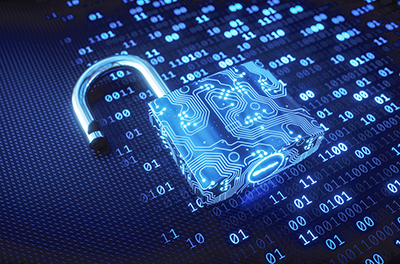

Los ordenadores cuánticos siguen estando a años o décadas de distancia. Sin embargo,
ayer la administración del presidente Joe Biden dio un paso para anticiparse al eventual
despliegue de tales máquinas. En un nuevo memorando de seguridad nacional, la Casa
Blanca da instrucciones a las agencias federales para que se preparen para cambiar los
algoritmos de encriptación utilizados hoy en día para asegurar las comunicaciones en
Internet y otras redes por nuevos algoritmos resistentes a los ataques de un ordenador
cuántico.

El memorando prevé que el cambio comience en 2024, cuando debería surgir el primer
estándar para esa &quot;criptografía post-cuántica&quot;, y que se complete antes de 2035.
Mientras que un ordenador convencional procesa la información volteando bits que pueden
ponerse a 0 o a 1, un ordenador cuántico manipula bits cuánticos o qubits que pueden
ponerse a 0, a 1 o, gracias a las extrañas reglas de la mecánica cuántica, a 0 y a 1 al mismo
tiempo. Estos estados bidireccionales permiten a un ordenador cuántico codificar todas las
posibles soluciones a ciertos problemas como ondas cuánticas abstractas.

Desde 2017, el NIST ha estado trabajando con investigadores para desarrollar estándares
para los algoritmos de criptografía poscuántica. Dentro de unas semanas, la agencia
anunciará el puñado de algoritmos ganadores para los que codificará estándares, dice
Moody. De este modo, el NIST estará en condiciones de anunciar esas normas antes de
2024.

Para el ciudadano medio, la transición a la criptografía postcuántica debería ser
prácticamente imperceptible. Sin embargo, para que los algoritmos funcionen eficazmente,
los fabricantes de microchips tendrán que modificar sus diseños, dice Lily Chen, matemática
del NIST. En consecuencia, la rapidez con la que se impongan los nuevos algoritmos
dependerá en gran medida de las decisiones de los fabricantes y vendedores de equipos,
afirma Chen. &quot;En algún momento, tendré un nuevo smartphone&quot;, dice, &quot;pero que el
smartphone utilice criptografía postcuántica será decisión del vendedor&quot;.

Curiosamente, aunque hay argumentos de peso que sugieren que un ordenador cuántico
nunca podrá descifrar los nuevos algoritmos, no hay ninguna prueba irrefutable. Pero eso
no es nada nuevo, señala Moody, ya que tampoco hay pruebas de que un superordenador
convencional pueda descifrar los actuales algoritmos de clave pública.

Para más información, pueden leer el artículo de SCIENCE en
https://www.science.org/content/article/worried-quantum-computers-will-supercharge-hacking-white-house-calls-encryption-shift