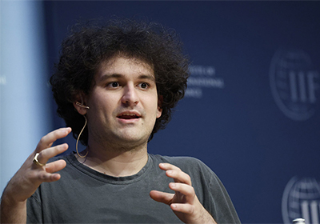

La quiebra la semana pasada de la bolsa de criptomonedas FTX está provocando
conmociones en la comunidad científica. Sam Bankman-Fried, de 30 años, estudiante de
física del MIT, fundador de FTX y multimillonario en poco tiempo, empezó a respaldar
organizaciones filantrópicas que apoyaban una amplia variedad de causas relacionadas con
la ciencia, la mayoría destinadas a mejorar el bienestar humano.

Ahora, con FTX en quiebra y bajo investigación por uso indebido del dinero de los inversores, sus fundaciones, antes
boyantes, se encuentran de repente sin liquidez y gran parte de ese trabajo está en peligro.
Una de ellas, Future Fund, se creó en febrero. A finales de junio, sus responsables habían
concedido 262 subvenciones e &quot;inversiones&quot; por un total de 132 millones de dólares.

No está claro cuánto de ese dinero se ha distribuido. Pero el 10 de noviembre, cinco altos
funcionarios del Fondo Futuro dimitieron y anunciaron en un comunicado: &quot;Estamos
desolados al decir que parece probable que haya muchas subvenciones comprometidas
que el Fondo Futuro no podrá cumplir&quot;.

&quot;Definitivamente es un desastre&quot;, afirma Josh Morrison, que dirige 1Day Sooner, una
organización de investigación y defensa de la preparación ante una pandemia que recibió
375.000 dólares del Future Fund y la Fundación FTX.
Otros destacados beneficiarios científicos del dinero del Future Fund son Sherlock
Biosciences, que recibió 2 millones de dólares para el diagnóstico de enfermedades
infecciosas basado en CRISPR; HelixNano, que recibió 10 millones de dólares para la
investigación de una vacuna eficaz contra todos los coronavirus diferentes, y SecureBio,
que recibió 1,2 millones de dólares para desarrollar mejores defensas contra la pandemia,
como un sistema de alerta temprana que analiza las aguas residuales en busca de material
genético patógeno.

El cofundador de SecureBio, Kevin Esvelt, biólogo del MIT, afirma que la organización sin
ánimo de lucro está evitando por ahora utilizar el dinero de la subvención del Fondo Futuro,
salvo para pagar los sueldos de las tres personas recién contratadas. &quot;No creemos que sea
justo que nadie pierda su empleo por una calamidad financiera totalmente ajena al
excelente trabajo que están realizando&quot;, afirma Esvelt.

El colapso de FTX era impensable sólo unos días antes. La empresa, que sirve de
plataforma de comercio en línea para criptodivisas, tenía activos de entre 10.000 y 50.000
millones de dólares, según documentos de la quiebra. Pero fue puesta de rodillas por una
corrida bancaria al viejo estilo, ya que los inversores intentaron retirar su dinero después de
que surgieran dudas sobre la salud financiera de FTX. La empresa se declaró en quiebra el
viernes 11 de noviembre, y pocas horas después unos piratas informáticos le robaron más
de 500 millones de dólares.

Los beneficiarios se preguntan cómo van a pagar las facturas. &quot;Obviamente, todo el mundo
está muy preocupado&quot;, dice Morrison.

Para más información, pueden leer el artículo de Science en
https://www.science.org/content/article/crypto-company-s-collapse-strands-scientists