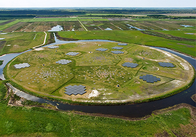

Poco después de que Jessica Dempsey se convirtiera en directora del Instituto Holandés de
Radioastronomía (ASTRON) en diciembre de 2021, se vio obligada a centrarse no en las
estrellas, sino en la factura de la luz. ASTRON opera el Conjunto de Baja Frecuencia
(LOFAR), que depende de grandes grupos de ordenadores para procesar los datos de
radioastronomía. Consumen unos 2.000 megavatios-hora al año, el equivalente a 800
hogares. Cuando Dempsey quiso renovar los contratos energéticos de ASTRON este
verano, se sorprendió al comprobar que los costes se habían triplicado con respecto a los
niveles de 2021.

El aumento de los precios de la energía está afectando duramente a Europa, y no sólo a los
hogares. Los institutos que operan con superordenadores, aceleradores y líneas de luz
láser que consumen mucha energía también están pasando apuros, y pueden ser los
canarios de las minas de carbón para el resto de la ciencia. Si los precios siguen
disparándose este otoño e invierno, &quot;el impacto para la ciencia va a ser significativo&quot;, afirma
Martin Freer, físico nuclear que dirige el Instituto de Energía de la Universidad de
Birmingham.

La causa principal de la crisis es el rebote de una desaceleración económica durante la
pandemia de COVID-19. Los generadores de electricidad que habían estado parados no
pudieron ponerse en marcha a tiempo para satisfacer la renovada demanda, afirma
Jonathan Stern, que estudia el gas natural en el Instituto de Estudios Energéticos de Oxford.
La invasión rusa de Ucrania en febrero empeoró la situación. Tanto las sanciones europeas
como las represalias rusas redujeron el suministro de gas natural ruso, que alimenta los
generadores eléctricos y calienta los edificios, y elevaron los precios del gas en Europa
continental a más de 10 veces sus valores medios históricos.

En DESY, el mayor centro de aceleración de Alemania, existe una preocupación similar. El
centro ha comprado suficiente energía por adelantado para que dure hasta 2023, pero
DESY podría no ser capaz de utilizar esos suministros si el gobierno alemán impone
restricciones energéticas nacionales, dice Wim Leemans, que dirige los programas de
aceleradores de DESY.

El CERN, el mayor laboratorio de física de partículas del mundo, situado en Suiza, también
observa con nerviosismo el desarrollo de la crisis energética. La organización compra
energía a la red francesa con años de antelación, pero ahora la preocupación es el
suministro. &quot;Este otoño no es un problema de precio, sino de disponibilidad&quot;, afirma Serge
Claudet, presidente del panel de gestión energética del CERN.

Esto podría tener consecuencias en el mundo real, advierte Freer. Pone el ejemplo de los
aceleradores de Birmingham que producen isótopos utilizados en imágenes médicas,
programas que tendrían que suspenderse, funcionar con pérdidas o repercutir sus costes en
los hospitales locales. &quot;Va a ser difícil salir adelante&quot;, afirma. &quot;Puede significar, como en el
caso de COVID, que haya un paréntesis en los programas científicos&quot;.

Para más información, pueden leer el artículo de Science en
https://www.science.org/content/article/europe-s-energy-crisis-hits-science