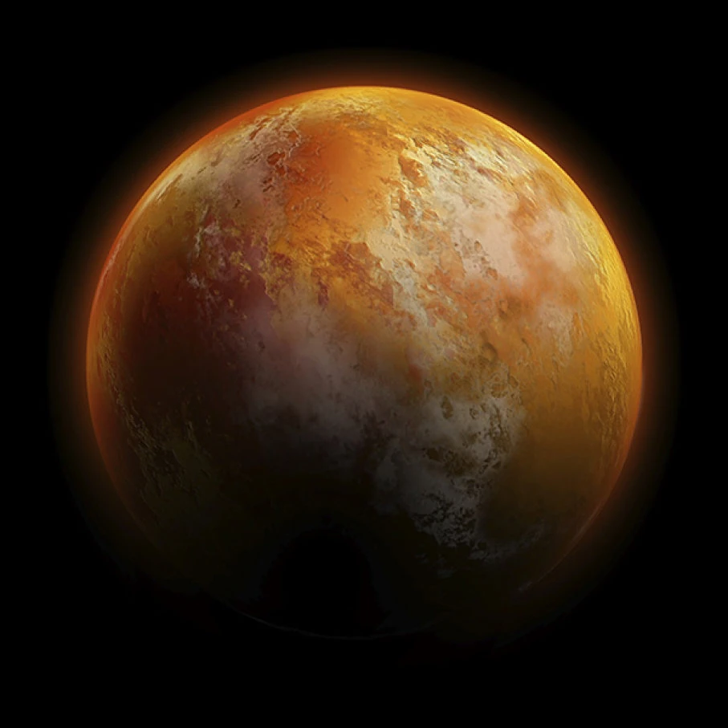

Frank Herbert, con su obra maestra "Dune", ha cautivado a las audiencias con su intrincada construcción de mundo y narrativa cautivadora. En el centro de esta epopeya yace Arrakis, el planeta desértico conocido cariñosamente como Dune, con su entorno implacable y sus enigmáticos gusanos de arena. ¿Qué pasaría si Arrakis fuera más que un simple reino ficticio? ¿Y si su clima y ecosistema fueran objeto de escrutinio científico?

Alexander Farnsworth, modelador climático de la Universidad de Bristol, y su equipo se embarcaron en un fascinante viaje para simular el clima de Arrakis. Inspirados por los sistemas climáticos terrestres y las descripciones detalladas de Herbert, exploraron las complejidades de la atmósfera, geografía y biología de Arrakis.

Sus hallazgos arrojan luz sobre la viabilidad de la vida en Arrakis, desacreditando algunos de los mitos perpetuados por las novelas de Herbert y reafirmando el atractivo del planeta como hábitat potencial para los humanos, aunque con desafíos significativos.

Arrakis, como lo imaginó Herbert, presume de un clima marcado por temperaturas extremas y escasa humedad atmosférica. La simulación de Farnsworth reveló un mundo donde las latitudes más altas sufren veranos abrasadores e inviernos gélidos, mientras que las regiones tropicales enfrentan vientos huracanados y dunas de arena imponentes.

Pero, ¿qué hay de los icónicos gusanos de arena que deambulan por los vastos desiertos de Arrakis? Farnsworth y el paleontólogo de vertebrados Patrick Lewis examinan la viabilidad de estas criaturas colosales, destacando los desafíos fisiológicos y ecológicos que enfrentarían en el áspero clima de Arrakis.

Desde las limitaciones en la absorción de oxígeno hasta las restricciones de la gravedad en el tamaño del cuerpo, la noción de gusanos de arena gigantes desafía los límites de la plausibilidad biológica. Los conocimientos de Lewis sobre fisiología de vertebrados arrojan dudas sobre la viabilidad de organismos tan masivos, subrayando las complejidades de la vida en Arrakis.

Para los fanáticos de "Dune", enfrentarse a las realidades de Arrakis ofrece una apreciación más profunda de la visionaria construcción de mundo de Herbert. Aunque vivir en Arrakis pueda parecer desalentador, sirve como testimonio de la resistencia y la ingeniosidad humanas ante la adversidad.

Para más información, pueden leer el artículo de Science en https://www.sciencenews.org/article/dune-planet-climate-plausible-science-sandworms?et_rid=960447322&et_cid=5125561