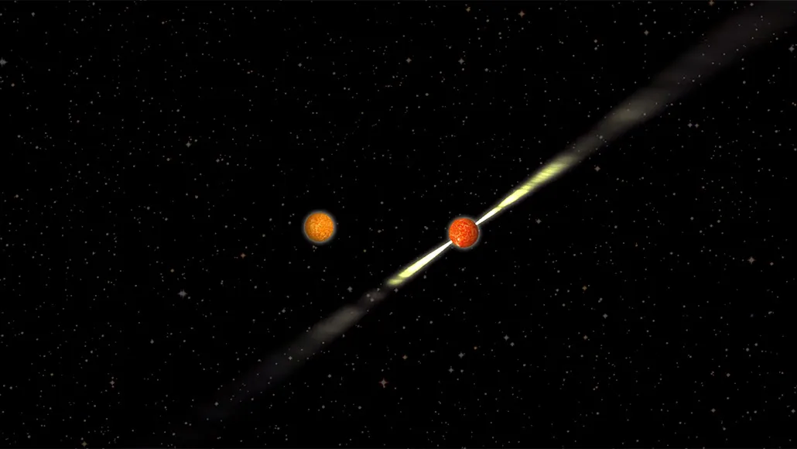

Las estrellas muertas giratorias, conocidas como púlsares, lanzan potentes haces de ondas de radio al espacio. Cuando un púlsar gira, sus haces barren la Tierra, produciendo una señal pulsante similar a los destellos de un faro. Los astrónomos han cartografiado la estructura de los haces de un púlsar a partir de observaciones realizadas durante décadas. La técnica se basa en la teoría de la gravedad de Albert Einstein, la relatividad general, y reconfirma simultáneamente que la teoría es correcta, informan los científicos en Science del 6 de septiembre. 

El resultado permitió a los investigadores "ver el haz de un púlsar de una forma totalmente nueva", afirma la astrofísica Victoria Kaspi, de la Universidad McGill de Montreal, que no participó en el nuevo estudio.  

Los púlsares son un tipo de estrella de neutrones, un denso remanente que queda tras la explosión de una estrella. Potentes campos magnéticos dirigen las ondas de radio de un púlsar hacia el exterior en forma de haces. Normalmente, esos haces pasan junto a la Tierra en un ángulo fijo, y los científicos sólo pueden vislumbrar un único corte a través de un haz a medida que gira, como si vieran el faro de un faro a través de una diminuta rendija. 

Pero el púlsar recién cartografiado, conocido como PSR J1906+0746, era inusual: formaba parte de un dúo, orbitando con otra estrella de neutrones, a unos 20.000 años luz de la Tierra (SN: 18/12/15). Según la relatividad general, si un púlsar gira en un ángulo desalineado con la órbita de la pareja -como ocurre en este caso-, el púlsar precesará. Esto significa que el eje sobre el que gira el púlsar gira, como una peonza. 

El nuevo retrato de un púlsar podría significar que los científicos tienen que replantearse algunas estimaciones anteriores sobre la frecuencia de las estrellas de neutrones y la frecuencia con la que se asocian. Si una estrella de neutrones tiene haces que nunca pasan junto a la Tierra, no parecerá pulsar. Por tanto, para tener en cuenta el número de las que no se ven, los astrónomos necesitan estimaciones precisas del tamaño y la forma de los haces de los púlsares.  

Futuros trabajos podrían precisar mejor el censo de estrellas de neutrones, lo que podría ayudar a los científicos que estudian las ondas gravitacionales. Las ondulaciones en el espaciotiempo pueden crearse cuando dos estrellas de neutrones en órbita chocan entre sí (SN: 16/10/17). Por tanto, una mejor estimación de la población de pares de estrellas de neutrones podría ayudar a predecir la frecuencia con la que las ondulaciones de sus colisiones podrían sacudir los detectores en el futuro (SN: 5/6/19). 

Y este púlsar inusual será fugaz, predicen los investigadores. Su ángulo está cambiando tanto que, en 2028, sus haces desaparecerán por completo de la vista de la Tierra.