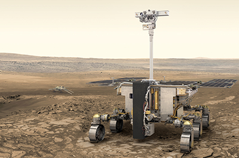

Tras una revisión técnica, la Agencia Espacial Europea (ESA) confirmó ayer que su rover de
Marte, que forma parte de la misión espacial ExoMars, está listo para su lanzamiento. El
único problema: el rover no tiene ni transporte al Planeta Rojo ni una nave de aterrizaje para
llevarlo con seguridad a la superficie. Se suponía que Rusia iba a proporcionar ambas
cosas, pero la ESA suspendió los vínculos y canceló el lanzamiento previsto en septiembre
después de que el país invadiera Ucrania el mes pasado. &quot;No había ninguna alternativa
real&quot;, dice el jefe del equipo de ExoMars, Thierry Blancquaert, del centro tecnológico de la
ESA en los Países Bajos.

   

Ahora, la ESA está estudiando opciones para mantener viva la misión de 1.000 millones de
euros. Incluso si la agencia puede sustituir las tecnologías rusas -y pagarlas-, es probable
que se retrase hasta 2028 o incluso 2030, dice Blancquaert. Los científicos planetarios
afirman que la espera merecerá la pena.

El módulo de aterrizaje de ExoMars no ha tenido una gestación fácil. Originalmente era una
colaboración entre la ESA y la NASA, pero Estados Unidos se retiró en 2012 por razones
presupuestarias. Rusia intervino para proporcionar un cohete Protón para su lanzamiento y
un vehículo de aterrizaje llamado Kazachok.

La ESA está ahora embarcada en un estudio de tres meses para ayudar a evaluar lo que es
posible. Si las relaciones con Rusia se restablecieran rápidamente, un lanzamiento en 2024
es ciertamente posible, dice Blancquaert, pero &quot;si tenemos que cambiar el hardware, no hay
manera de que estemos listos para 2024&quot;. A medida que la guerra se prolonga en Ucrania,
un rápido acercamiento parece cada vez más improbable.

Una fecha de lanzamiento en 2026 podría ser posible si la ESA contara con ayuda. La
NASA ha dicho que está en conversaciones con la ESA para ver qué podría aportar. &quot;La
NASA no tiene mil millones de dólares para construir un módulo de aterrizaje para la ESA&quot;,
dice el ingeniero aeroespacial Zachary Putnam, de la Universidad de Illinois, Urbana-
Champaign, que ha realizado numerosos estudios sobre sistemas de aterrizaje en Marte
patrocinados por la NASA. Pero si la ESA sólo buscara RHU y retrorreactores, &quot;éstos
podrían ser suministrados por proveedores de Estados Unidos&quot;, afirma. Sin embargo, si la
ESA tiene que ir sola, 2028 parece la fecha de lanzamiento más temprana posible, dice
Blancquaert: &quot;Nos da más tiempo para finalizar la tecnología europea&quot;.

Para más información, pueden leer el artículo de SCIENCE en
https://www.science.org/content/article/europe-fights-keep-mars-rover-alive-after-split-russia