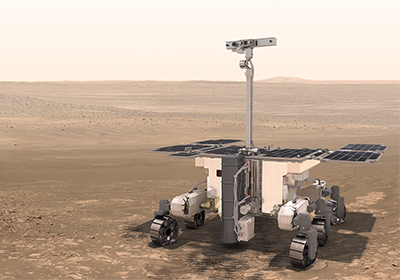

Tras repetidos retrasos y la pérdida de sus cohetes de fabricación rusa, el explorador
europeo ExoMars se lanzará de nuevo en 2028, según acordaron la semana pasada los
ministros del Gobierno. Estaba previsto que el rover partiera hacia el Planeta Rojo en
septiembre en un cohete ruso Protón y aterrizara en una nave de fabricación rusa, hasta
que la Agencia Espacial Europea (ESA) cortó lazos con Rusia tras su invasión de Ucrania.
La semana pasada, en una reunión para fijar el presupuesto, la ESA decidió lanzar la misión
en un cohete estadounidense aún por determinar y desarrollar su propio módulo de
aterrizaje, con alguna ayuda de la NASA.

   

El anuncio se produjo al término de una reunión presupuestaria de los 22 Estados miembros
de la ESA que se celebra cada 3 años. Los ministros aprobaron una financiación de 16.900
millones de euros para los próximos 5 años destinada a ciencia, exploración, cohetes,
observación de la Tierra y telecomunicaciones.

Thierry Blancquaert, jefe del equipo ExoMars de la ESA, explica que para construir un
nuevo sistema de aterrizaje sin Rusia &quot;no partimos de cero&quot;. La mayoría de los
componentes de Schiaparelli funcionaron a la perfección, y la ESA proporcionó -y puede
reutilizar- algunos sistemas de Kazachok, como los paracaídas, el radar, las
comunicaciones por radio y el ordenador de a bordo. Los ingenieros se encargará ahora de
desmontarlos del módulo de aterrizaje ruso, que permanece en Italia, donde estaba previsto
enviarlo al centro de lanzamiento ruso de Baikonur (Kazajstán), junto con el rover, cuando
Rusia invadió el país. 

Pero ningún fabricante europeo fábrica el tipo de propulsores
necesarios para posar suavemente la Rosalind Franklin, de 310 kilos, sobre la superficie.
Aquí es donde entra en juego la NASA, dice Blancquaert. Se ha ofrecido a un fabricante
estadounidense para suministrar los propulsores.

Los verdaderos perdedores del nuevo acuerdo son los científicos -tanto rusos como
europeos- que diseñaron los instrumentos que se montaron en el módulo de aterrizaje
Kazachok. Debido al apretado calendario de desarrollo del nuevo módulo de aterrizaje de la
ESA, éste no realizará ninguna actividad científica. &quot;Mi sensación es de gran desánimo
debido a la actual situación geopolítica&quot;, afirma Francesca Esposito, del Observatorio
Astronómico de Capodimonte, que construyó un sensor de polvo para el anterior módulo de
aterrizaje. &quot;Pero estoy muy contenta de que esto no haya detenido esta gran misión&quot;.

Para más información, pueden leer el artículo de Science en
https://www.science.org/content/article/europe-pledges-launch-mars-rover-delayed-war

