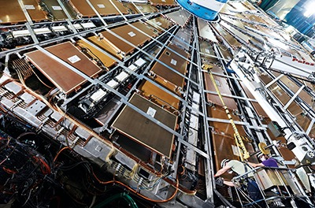

Hace una década, los físicos de partículas emocionaron al mundo. El 4 de julio de 2012,
6.000 investigadores que trabajaban en el mayor triturador de átomos del mundo, el Gran
Colisionador de Hadrones (LHC) del laboratorio europeo de física de partículas CERN,
anunciaron que habían descubierto el bosón de Higgs, una partícula masiva y fugaz clave
para su abstrusa explicación de cómo otras partículas fundamentales obtienen su masa. El
descubrimiento cumplía una predicción de hace 45 años, completaba una teoría llamada
modelo estándar.

Luego vino una larga resaca. Antes de que el LHC, con forma de anillo y 27 kilómetros de
longitud, empezara a tomar datos en 2010, los físicos temían que pudiera producir el bosón
de Higgs y nada más, sin dejar ninguna pista de lo que hay más allá del modelo estándar.

Hasta ahora, ese escenario de pesadilla se está haciendo realidad. &quot;Es un poco
decepcionante&quot;, permite Barry Barish, físico del Instituto Tecnológico de California. &quot;Pensé
que descubriríamos la supersimetría&quot;, la principal extensión del modelo estándar.
Desde la década de 1970, los físicos se han enzarzado en un combate con el modelo
estándar. Éste sostiene que la materia ordinaria está formada por partículas ligeras
llamadas quarks up y quarks down -que se unen en tríos para formar protones y neutrones-
junto con electrones y partículas de peso pluma llamadas neutrinos electrónicos. Hay dos
conjuntos de partículas más pesadas que acechan en el vacío y que pueden ser lanzadas a
la existencia fugaz en colisiones de partículas. Todas interactúan mediante el intercambio
de otras partículas: El fotón transmite la fuerza electromagnética, el gluón la fuerza fuerte
que une a los quarks y los bosones masivos W y Z la fuerza débil.

El modelo estándar describe todo lo que los científicos han visto hasta ahora en los
colisionadores de partículas. Sin embargo, no puede ser la teoría definitiva de la naturaleza.
No incluye la fuerza de la gravedad ni la misteriosa e invisible materia oscura, que parece
superar en seis veces a la materia ordinaria del universo.

Los físicos del acelerador han estado afinando lentamente los haces del LHC durante
meses, dice Lamont. Sólo cuando los haces sean lo suficientemente estables encenderán
los detectores y reanudarán la toma de datos. Esos interruptores deberían activarse el 5 de
julio, 10 años y un día después del anuncio del descubrimiento del bosón de Higgs, dice
Lamont. &quot;Es bueno entrar en un funcionamiento sostenido&quot;.

Para más información, pueden leer el artículo de SCIENCE en
https://www.science.org/content/article/ten-years-after-higgs-physicists-face-nightmare-finding-