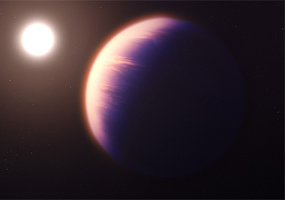

Los astrónomos han hallado dióxido de carbono (CO2) en la atmósfera de un planeta del
tamaño de Saturno situado a 700 años luz, lo que supone la primera detección inequívoca
de este gas en un planeta fuera del Sistema Solar. El descubrimiento, realizado por el
telescopio espacial James Webb, proporciona pistas sobre cómo se formó el planeta. El
resultado también muestra la rapidez con la que Webb puede identificar otros gases, como
el metano y el amoníaco, que podrían indicar la posible habitabilidad de un planeta para la
vida.

El telescopio Webb es sensible a las longitudes de onda infrarrojas de la luz, bloqueadas en
su mayor parte por la atmósfera terrestre. Ya ha deslumbrado a los astrónomos por su
capacidad para observar las estrellas y galaxias más lejanas del Universo.
Pero la sensibilidad infrarroja también es fundamental para los investigadores que estudian
mundos mucho más cercanos, en la Vía Láctea. Cuando la órbita de un exoplaneta lo sitúa
frente a su estrella, parte de la luz estelar atraviesa la atmósfera del planeta y deja huellas
de su composición.

Webb promete revelar muchos más gases en planetas más pequeños del tamaño de
Neptuno y, potencialmente, incluso en planetas rocosos de tamaño similar a la Tierra,
aunque es poco probable que pueda confirmar la existencia de vida.
Para sus primeras observaciones de exoplanetas, los astrónomos se centraron en el
gigante de gas caliente WASP-39b, que orbita su estrella cada 4 días en una órbita mucho
más cerrada que la de Mercurio.

Hubble y Spitzer han encontrado previamente vapor de agua, sodio y potasio en la
atmósfera de WASP-39b. Webb ha añadido ahora CO2, así como otro gas cuya firma
espectral era inicialmente un misterio. Observaciones posteriores revelaron de qué se trata,
pero Bean no quiso decir nada al respecto hasta que el resultado sea revisado por pares.
En los próximos meses, el equipo publicará el espectro completo del planeta, desde el
óptico hasta el infrarrojo medio, y &quot;realizará un inventario químico completo de su
atmósfera&quot;, explica Laura Kreidberg, del Instituto Max Planck de Astronomía.

Encontrar CO2 es valioso porque es una pista de la &quot;metalicidad&quot; de un planeta: la
proporción de elementos más pesados que el helio en su composición. El hidrógeno y el
helio producidos en el Big Bang son los materiales de partida de toda la materia visible en el
universo, pero todo lo más pesado se forjó más tarde en las estrellas. Los investigadores
creen que un buen suministro de elementos pesados es crucial para crear planetas
gigantes. Cuando los planetas se forman a partir de un disco de material alrededor de una

nueva estrella, los elementos más pesados forman granos sólidos y guijarros que se pegan
en un núcleo sólido que finalmente es lo suficientemente masivo como para atraer gases
con su propia gravedad y convertirse en un gigante gaseoso.
Con Webb, encontrar &quot;sustancias químicas importantes será la norma y no la excepción&quot;,
afirma Madhusudhan. Predice que cuando Webb empiece a estudiar planetas más fríos y
cercanos en tamaño a la Tierra, habrá algunas sorpresas reales, tal vez algunos gases que
podrían indicar si los planetas son susceptibles de albergar vida. &quot;Cualquiera puede
adivinarlo&quot;, afirma. &quot;Todo un zoo de sustancias químicas es posible&quot;.

Para más información, pueden leer el artículo de Science en
https://www.science.org/content/article/carbon-dioxide-detected-around-alien-world-first-time