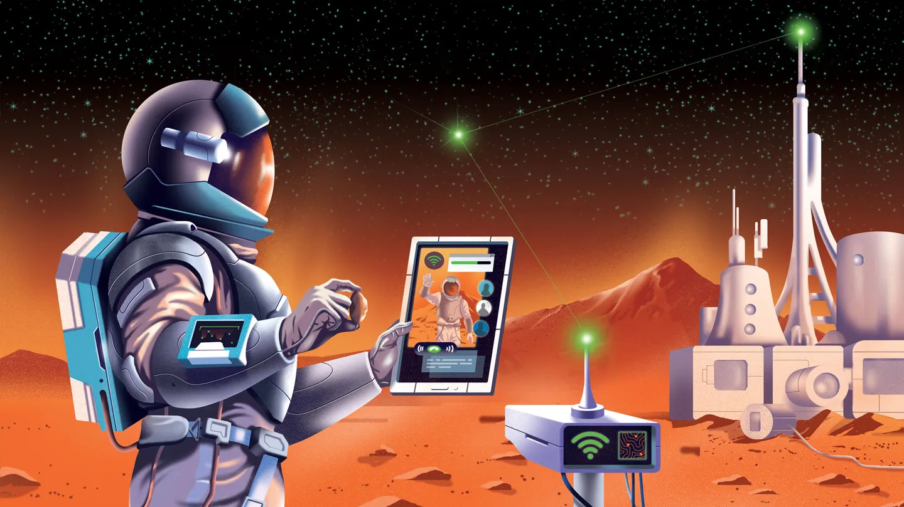

Cuando los astronautas aterricen en Marte, quizás dentro de unas décadas, necesitarán establecer comunicaciones efectivas entre ellos, con el equipo en el planeta y con el control de misión en la Tierra. Sin embargo, una conexión Wi-Fi a internet desde la Tierra no será viable debido a la gran distancia entre los planetas, que puede variar entre 55 y 400 millones de kilómetros dependiendo de sus órbitas.

Para superar este desafío, se están explorando diferentes estrategias de comunicación. Por ejemplo, la misión Psyche de la NASA está probando la comunicación interplanetaria utilizando láseres, que pueden transportar mucha más información que las ondas de radio utilizadas actualmente. Sin embargo, ninguna estrategia puede eliminar completamente el retraso en las comunicaciones entre la Tierra y Marte, que puede variar entre cuatro y 24 minutos para un viaje de ida.

Además, existe el problema de la conjunción solar, que interrumpe las comunicaciones entre los planetas durante un par de semanas cada dos años aproximadamente. A pesar de estos desafíos, se están explorando nuevas posibilidades para mejorar las comunicaciones en Marte y hacerlas más similares a las que experimentamos en la Tierra.

En la actualidad, las comunicaciones con Marte se realizan a través de una Red de Relevo de Marte, que consta de cinco orbitadores alrededor del planeta. Estos orbitadores transmiten información utilizando antenas dirigidas hacia la Tierra. Sin embargo, una vez que una tripulación humana aterrice en Marte, este sistema no será suficiente.

Se están considerando varias opciones para mejorar las comunicaciones en Marte. Por ejemplo, la ESA está explorando un concepto llamado Infraestructura de Comunicación y Navegación de Marte (MARCONI), que desarrollaría cargas útiles para proporcionar comunicación de radio en y con Marte.

Además, se está considerando el uso de enlaces láser, que podrían transportar hasta 100 veces más datos que las frecuencias de radio tradicionales. Estas señales ópticas podrían ser el futuro de la comunicación espacial.

En resumen, establecer una infraestructura de comunicaciones efectiva en Marte es esencial para las misiones humanas futuras. A pesar de los desafíos, los avances en tecnología están abriendo nuevas posibilidades para mejorar las comunicaciones en el planeta rojo.

Para más información, pueden leer el articulo de Science
https://www.sciencenews.org/article/mars-internet-communication-rover-psyche
