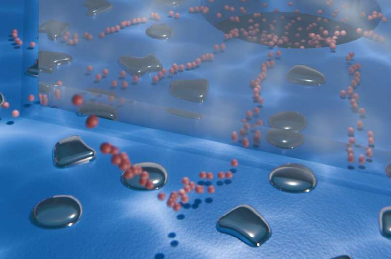

Los investigadores del Laboratorio de Biología a Nanoescala de la Escuela de Ingeniería de la EPFL han desarrollado un nuevo dispositivo nanofluídico basado en iones para aplicaciones de memoria, con el objetivo de imitar más de cerca el procesamiento de la información del cerebro humano. Este dispositivo, llamado memristor, puede computar y almacenar datos de manera similar a una sinapsis, utilizando iones en lugar de electrones. Los científicos han logrado conectar dos de estas "sinapsis artificiales", abriendo el camino para el diseño de hardware líquido inspirado en el cerebro.

Los memristores pueden cambiar entre dos estados de conductancia utilizando un voltaje aplicado. A diferencia de los memristores electrónicos, que se basan en electrones y huecos para procesar información digital, el memristor nanofluídico desarrollado por el LBEN puede aprovechar diferentes tipos de iones, como potasio, sodio y calcio. Los investigadores han demostrado que pueden ajustar la memoria del dispositivo cambiando los iones utilizados, lo que afecta a la forma en que se enciende o apaga y a la cantidad de memoria que almacena.

El dispositivo fue fabricado en un chip en el Centro de MicroNanoTecnología de la EPFL, utilizando un nanoporo en una membrana de nitruro de silicio y capas de paladio y grafito para crear nanocanales para los iones. Cuando fluye una corriente por el chip, los iones convergen en el nanoporo, creando una ampolla entre la superficie del chip y el grafito. Esta ampolla levanta la capa de grafito, lo que activa el estado de memoria del dispositivo. Un voltaje negativo vuelve a poner en contacto las capas, restableciendo la memoria al estado "apagado".

Además, los investigadores han logrado conectar dos memristores nanofluídicos con un electrodo para formar un circuito lógico basado en el flujo de iones, lo que representa la primera demostración de operaciones lógicas digitales basadas en dispositivos iónicos similares a una sinapsis. En el futuro, los investigadores planean conectar una red de memristores nanofluídicos con canales de agua, lo que permitiría la creación de circuitos totalmente líquidos. Esto podría tener aplicaciones en interfaces cerebro-ordenador o neuromedicina, y también proporcionaría un mecanismo de refrigeración incorporado.

Para más información, pueden leer el artículo de Quan Magazine en:
https://techxplore.com/news/2024-03-artificial-nanofluidic-synapses-memory.html