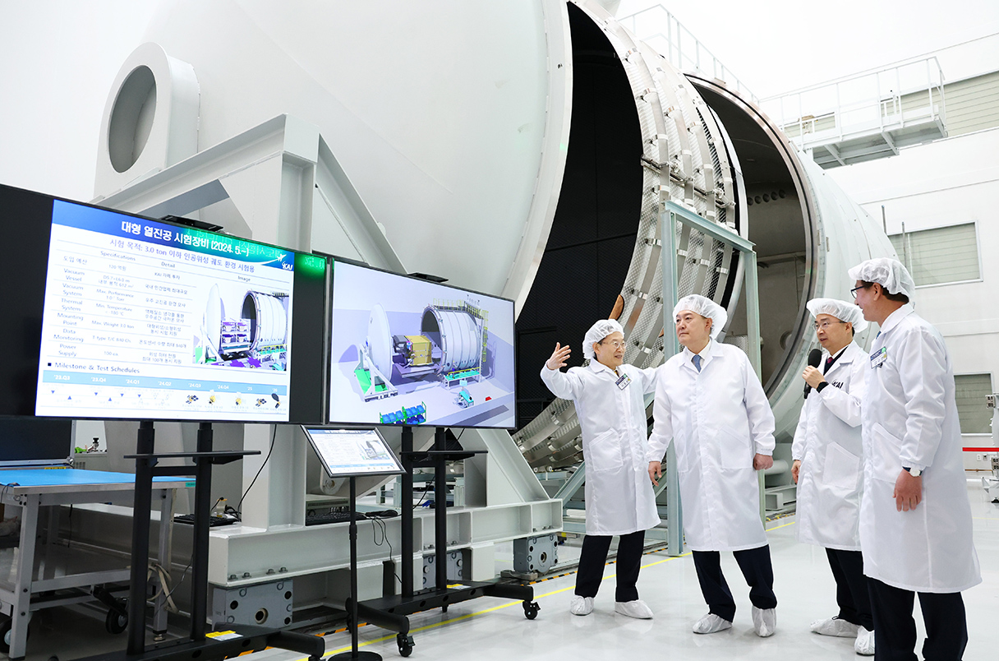

Corea del Sur ha creado oficialmente una nueva agencia, la Administración Aeroespacial de Corea (KASA), que tiene como objetivo desarrollar las capacidades de lanzamiento comercial y de satélites del país. Siguiendo el modelo de la NASA estadounidense, la KASA también se ha encomendado la tarea de aterrizar naves espaciales en la Luna para 2032 y en Marte para 2045, así como fomentar la ciencia de vanguardia.

La creación de la KASA reúne bajo un mismo techo programas espaciales anteriormente dispersos en el gobierno. Esto cumple con la promesa electoral del presidente surcoreano Yoon Suk Yeol, quien asumió el cargo en mayo de 2022. El presidente considera que un programa espacial más fuerte impulsaría el crecimiento económico y se ha previsto un aumento en el gasto en programas espaciales de 1,5 billones de wones (1.100 millones de dólares) en los próximos 5 años, de 2022 a 2027.

Gran parte de esta financiación se destinará al desarrollo de cohetes, satélites y otras tecnologías con aplicaciones comerciales. Sin embargo, el plan del Comité Espacial Nacional también busca promover la investigación científica espacial puntera que contribuya a la expansión del conocimiento humano.

Este plan se basa en el éxito reciente de Corea del Sur en su primera misión de exploración espacial, el Korea Pathfinder Lunar Orbiter (KPLO), que transporta cinco instrumentos científicos que recopilan datos detallados sobre la Luna.

El establecimiento de la KASA representa un paso significativo para que Corea del Sur se una a las potencias espaciales mundiales y capte su parte en la exploración espacial y la investigación científica. A través del desarrollo de capacidades de lanzamiento comercial, la agencia contribuirá al crecimiento económico y promoverá la industria espacial de Corea del Sur. Además, los ambiciosos planes de aterrizaje en la Luna y en Marte están destinados a expandir el conocimiento humano y establecer a Corea del Sur como un actor importante en la exploración espacial. Con una inversión significativa en programas espaciales y el apoyo de los científicos, Corea del Sur espera alcanzar importantes avances tecnológicos y científicos en el campo aeroespacial en los próximos años.

Para más información, pueden leer el articulo de Science
https://www.science.org/content/article/south-korea-launches-its-own-nasa