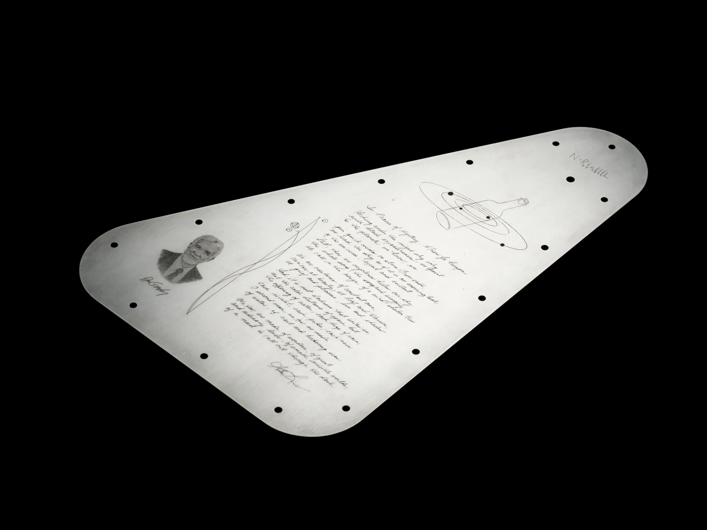

La NASA ha anunciado un emocionante proyecto para su próxima misión Europa Clipper, que se lanzará en octubre. Esta nave espacial llevará consigo un mensaje único hacia la luna de Júpiter, Europa, que incluirá más de 2.6 millones de nombres enviados por el público. Además, una placa triangular de metal grabada con un poema de la Poeta Laureada de EE. UU., Ada Limón, será el centro de atención de este mensaje. Esta iniciativa, inspirada en la tradición de enviar mensajes inspiradores al espacio, busca honrar la conexión entre la Tierra y Europa, que muestra evidencia de un océano debajo de su corteza helada.

La placa de metal, que será parte de la nave Europa Clipper, no solo contendrá nombres del público, sino que también destacará elementos que simbolizan la relación entre la Tierra y Europa. Además del poema de Ada Limón, la placa incluirá grabaciones del término "agua" en 103 idiomas, así como la ecuación de Drake, que busca estimar la posibilidad de encontrar civilizaciones avanzadas fuera de la Tierra. Esta placa busca inspirar y unificar visiones, llevando un mensaje de conexión y exploración al espacio exterior.

El diseño de la placa de metal también incluirá referencias a frecuencias de radio utilizadas para la comunicación interestelar, simbolizando cómo la humanidad utiliza estas frecuencias para escuchar mensajes del cosmos. Además, se rendirá homenaje a Ron Greeley, uno de los fundadores de la ciencia planetaria, cuyos esfuerzos para desarrollar una misión a Europa sentaron las bases para Europa Clipper. Este proyecto, que combina elementos científicos, artísticos y culturales, busca llevar un mensaje de unidad y exploración a través del vasto cosmos.

La misión Europa Clipper de la NASA tiene como principal objetivo determinar si hay lugares debajo de la luna helada de Júpiter, Europa, que podrían albergar vida. Con tres objetivos científicos principales, esta misión investigará la composición, geología y grosor de la corteza helada de Europa, así como sus interacciones superficiales con el océano subsuperficial. El análisis detallado de Europa ayudará a los científicos a comprender mejor el potencial astrobiológico de mundos habitables más allá de nuestro planeta.

Para más información, pueden leer el articulo de NASA
https://www.nasa.gov/missions/europa-clipper/nasa-unveils-design-for-message-heading-to-jupiters-moon-europa/
