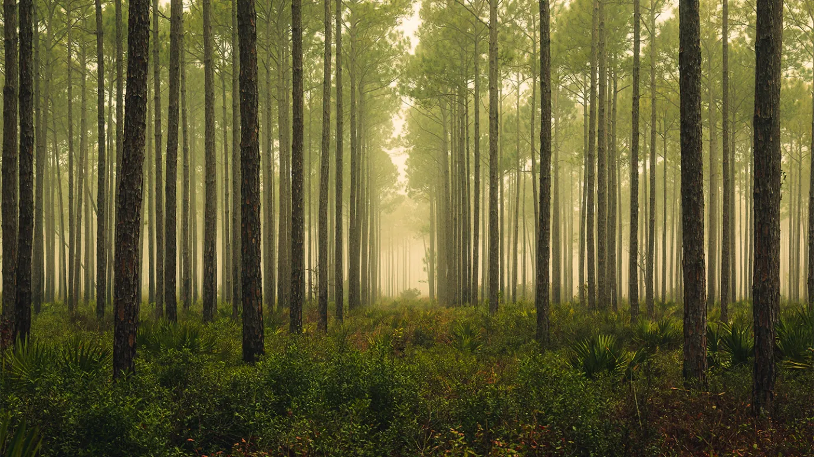

Los detectores de neutrinos no crecen en los árboles. ¿O sí? Los bosques podrían servir algún día para detectar neutrinos de muy alta energía, según propone un físico.

Los árboles podrían actuar como antenas naturales que captaran las ondas de radio producidas por ciertas interacciones de las partículas subatómicas difíciles de detectar, propone el físico de astropartículas Steven Prohira en un artículo presentado el 25 de enero en arXiv.org.

"Es una idea muy emocionante", afirma la física Amy Connolly, de la Universidad Estatal de Ohio en Columbus, que no participó en el estudio. "Esto podría ser... una solución natural que puede haber estado ahí delante de nuestras narices".

Los neutrinos suelen requerir detectores grandes y sensibles. Esto es especialmente cierto en el caso de los detectores diseñados para captar los neutrinos más raros y de mayor energía que llegan a la Tierra desde el espacio. Construir desde cero estos enormes detectores es un gran obstáculo.

Pero los físicos especializados en neutrinos de alta energía son conocidos por construir detectores ingeniosos en entornos naturales. El Observatorio de Neutrinos IceCube busca interacciones de neutrinos utilizando un kilómetro cúbico de hielo antártico, y el Telescopio de Neutrinos de Kilómetro Cúbico, KM3NeT, actualmente en construcción, buscará neutrinos que interactúen en el Mar Mediterráneo. Estos detectores tienen volúmenes suficientemente grandes para hacer posible la captura de neutrinos raros de alta energía.

Para estudiar los neutrinos de energías aún más elevadas, los científicos pretenden detectar una variedad particular de neutrino, denominada neutrino tau. Cuando un neutrino de este tipo pasa por el interior de la Tierra, puede interactuar y producir una partícula llamada leptón tau. Si ese leptón tau escapa del suelo a la atmósfera terrestre, su desintegración puede producir una lluvia de partículas cargadas que generan ondas de radio. Para detectar estas ondas de radio, los científicos han propuesto detectores como el experimento masivo GRAND, que utilizaría un total de 200.000 antenas divididas en 20 conjuntos distintos repartidos por todo el mundo.

Dada la enorme tarea que supone construir ese tipo de detector, "se me ocurrió que sería genial que las antenas ya estuvieran ahí", dice Prohira, de la Universidad de Kansas en Lawrence.

Investigaciones anteriores habían demostrado que los árboles pueden captar ondas de radio. Para detectarlas habría que clavar un cable en cada árbol o enrollar una bobina alrededor de su tronco y conectarla a un sistema electrónico para leer las señales.

Aún quedan muchas preguntas por responder para determinar si la técnica es plausible, reconoce Prohira. Los científicos tendrían que estudiar cómo funcionan los árboles con ondas de radio de muy alta frecuencia, el rango en el que operan los detectores de neutrinos de este tipo. Y las antenas de radio tradicionales pueden construirse con precisión, lo que permitiría comprender en detalle cómo responden a distintos tipos de señales de radio. Los árboles, por supuesto, no pueden serlo. Por ejemplo, no está claro cómo responderían los árboles a la polarización de las ondas de radio, la orientación de sus ondulaciones. Además, hay que investigar el efecto del follaje y, en el caso de los bosques caducifolios, la caída estacional de las hojas.
Aunque la idea es inspiradora, dice el físico Eric Oberla, de la Universidad de Chicago, "no está claro si sustituir las antenas fabricadas por árboles resolverá más problemas de los que podría crear, y habría que seguir estudiando estos retos de diseño del detector".

También habría que conocer el impacto que el detector tendría en el bosque. "Un detector así", escribe Prohira en el artículo, "debe construirse en armonía con la naturaleza y respetándola; de lo contrario, no merece la pena intentarlo".