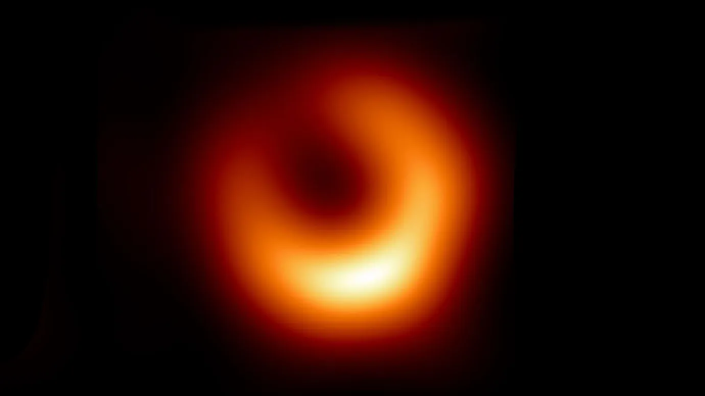

Acaba de aparecer una nueva imagen del agujero negro supermasivo que acecha en la galaxia M87.

La nueva imagen se parece mucho a la anterior, que acaparó titulares y fue revelada en 2019. La principal diferencia es que el punto más brillante alrededor del agujero negro se ha desplazado en sentido antihorario unos 30 grados, informan los investigadores el 18 de enero en Astronomy & Astrophysics. Esto se debe probablemente al material que se desplaza en el disco de acreción del agujero negro a medida que se consume.

Pero otros aspectos no han cambiado. Un anillo brillante y la sombra del agujero negro parecen tener casi exactamente el mismo tamaño que antes. Esto ayuda a confirmar que el agujero negro de M87 es del tipo predicho por la teoría general de la relatividad de Einstein y no alguna variedad más exótica o inesperada, afirma la astrofísica Lia Medeiros, de la Universidad de Princeton.

"En ciencia, siempre es muy importante realizar los mismos experimentos o experimentos similares varias veces", afirma Medeiros. Ayuda a "asegurarte de que no te estás engañando a ti mismo y de que tus resultados son reproducibles".

Medeiros forma parte de una colaboración internacional llamada Event Horizon Telescope, o EHT, que utilizó una red de radiotelescopios de todo el mundo para acercarse al corazón de M87, a unos 55 millones de años luz de la Tierra. Anteriormente, todas las imágenes del EHT -incluidas las del agujero negro supermasivo en el centro de nuestra propia galaxia- utilizaban datos tomados en 2017 o antes. La nueva imagen es la primera que incorpora observaciones de 2018.

Mientras tanto, el equipo del EHT añadió otro telescopio a su colección: el Telescopio de Groenlandia, en el noroeste de Groenlandia. Dado que la técnica que utilizan los investigadores, conocida como interferometría, mejora con más instalaciones, la nueva imagen contiene detalles antes inaccesibles sobre el gigantesco agujero negro de M87, en los que los investigadores profundizarán más adelante.