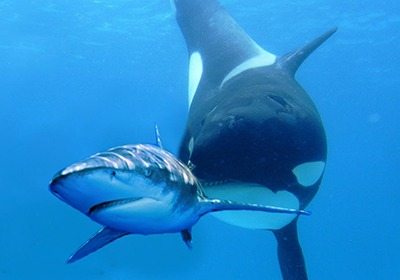

Un océano más caliente es un océano más hambriento, al menos en lo que respecta a los
depredadores de peces. En un nuevo estudio de campo los científicos del Smithsonian
descubrieron que los impactos de los depredadores en el Atlántico y el Pacífico alcanzan su
punto máximo con temperaturas más altas. Los efectos se transmiten en cascada para
transformar otras formas de vida en el océano, alterando potencialmente los equilibrios que
han existido durante milenios.

El nuevo estudio ha sido uno de los más amplios realizados hasta la fecha. Un equipo
internacional dirigido por el Smithsonian y la Universidad de Temple coordinó a sus socios
en 36 lugares, a lo largo de las costas del Atlántico y el Pacífico de América.
En el primer experimento, siguieron la actividad general de los depredadores mediante
&quot;pops de calamar&quot;. Los científicos fijan un trozo de calamar seco, un cebo estándar que se
puede utilizar en cualquier lugar, a una estaca y lo dejan bajo el agua para atraer a los
peces. Al cabo de una hora, los científicos comprobaron cuántos pops de calamar habían
sido devorados. Los resultados confirmaron sus sospechas: En los lugares más cálidos, la
depredación era más intensa; en las aguas más frías (por debajo de los 68 grados F), la
depredación se reducía casi a cero.

Pero esto no responde a la pregunta más apremiante: ¿Qué significará un océano más
caliente y hambriento para el resto de la vida en la red alimentaria?
Para ello, los investigadores recurrieron a sus dos últimos experimentos. En un
experimento, observaron cómo las presas colonizaban y crecían en paneles de plástico
submarinos durante tres meses. En el último experimento, colocaron jaulas protectoras
alrededor de todas las presas submarinas durante 10 semanas, y luego desenjaularon la
mitad de las comunidades de presas durante dos semanas más.

En las aguas más cálidas, el apetito más voraz de los depredadores dejó huellas enormes
en la comunidad de presas. La biomasa total de presas se redujo en los trópicos cuando se
dejaron sin protección. Pero en las zonas más frías, dejar las presas expuestas o protegidas
no supuso casi ninguna diferencia, lo que sugiere que los depredadores no representaban
una gran amenaza allí.
Para más información, pueden leer el artículo de ScienceDaily en
https://www.sciencedaily.com/releases/2022/06/220609155808.htm

