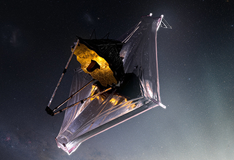

El telescopio espacial James Webb de la NASA mostrará sus primeras imágenes a todo
color y sus primeros datos espectroscópicos el 12 de julio. Webb, el observatorio más
grande y complejo jamás lanzado al espacio, ha pasado por un período de preparación de
seis meses antes de poder comenzar su trabajo científico, calibrando sus instrumentos a su
entorno espacial.

Este cuidadoso proceso, sin mencionar los años de desarrollo de nuevas tecnologías y
planificación de la misión, ha ido evolucionando hasta lograr las primeras imágenes y los
primeros datos: una demostración de Webb a su plena capacidad, listo para comenzar su
misión científica y revelar el universo infrarrojo.

“A medida que nos acercamos al final de la preparación de este observatorio para la
investigación científica, nos encontramos en el umbral de un período increíblemente
emocionante de descubrimientos sobre nuestro universo. La revelación de las primeras
imágenes a todo color de Webb ofrecerá un momento único para que todos nos
detengamos y nos maravillemos con una vista que la humanidad nunca antes ha
contemplado”, dijo Eric Smith, científico del programa de Webb en la sede de la NASA en
Washington. “Estas imágenes serán la culminación de décadas de dedicación, talento y
sueños, pero también serán apenas el comienzo”.

Decidir lo que Webb debía mirar primero ha sido un proyecto de más de cinco años de
desarrollo, llevado a cabo por una asociación internacional entre la NASA, ESA, la Agencia
Espacial Canadiense y el Instituto de Ciencias del Telescopio Espacial en Baltimore.
Si bien la cuidadosa planificación de las primeras imágenes a todo color de Webb ha estado
en marcha durante mucho tiempo, el nuevo telescopio es tan poderoso que es difícil
predecir exactamente cómo se verán las primeras imágenes. “Por supuesto, hay cosas que
anticipamos y que esperamos ver, pero con un nuevo telescopio y con estos nuevos datos
infrarrojos de alta resolución, simplemente no lo sabremos hasta que lo veamos”, dijo
Joseph DePasquale, desarrollador principal de imágenes científicas de STScI.

Después de capturar sus primeras imágenes, comenzarán las observaciones científicas de
Webb, continuando con la exploración de los temas científicos clave de la misión. Los
equipos ya han solicitado, mediante un proceso competitivo, tiempo para usar el telescopio,
en lo que los astrónomos llaman su primer “ciclo”, o primer año de observaciones. Las
observaciones se programan cuidadosamente para hacer el uso más eficiente del tiempo
del telescopio.

Para más información, pueden leer el artículo de NASA en
https://www.nasa.gov/feature/goddard/2022/first-images-from-nasa-s-webb-space-telescope-
coming-soon

