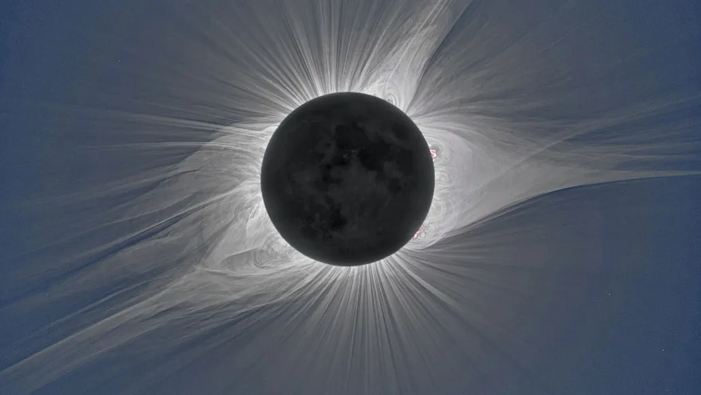

El próximo eclipse total de sol del 8 de abril de 2024 está generando una gran expectación entre los astrónomos y el público en general. Este eclipse promete ser un acontecimiento extraordinario, con una totalidad más larga y un sol más activo que en eclipses anteriores.

Un factor clave que contribuye a la prolongada duración de la totalidad es la proximidad de la Luna a la Tierra en su órbita, lo que da lugar a casi 4½ minutos de oscurecimiento solar completo. Este periodo prolongado ofrece a los observadores una oportunidad única de presenciar los asombrosos fenómenos del eclipse.

Además, la mayor actividad del sol cerca del máximo solar añade otra dimensión al espectáculo. Con el sol emitiendo brillantes chorros de plasma en forma de pétalo que se extienden desde su corona, el eclipse está preparado para ofrecer un espectáculo visualmente cautivador de fenómenos solares.

La accesibilidad es otro de los aspectos destacados de este eclipse, con aproximadamente 32 millones de personas situadas dentro de la trayectoria de la totalidad, una cifra significativamente superior a la de acontecimientos anteriores. Las principales áreas metropolitanas de la Costa Este, desde Baltimore hasta Boston, se encuentran cerca de la trayectoria, lo que permite una amplia visibilidad y participación en todo Estados Unidos.

Los avances tecnológicos mejorarán aún más el estudio científico del eclipse. Los científicos tienen previsto utilizar una serie de instrumentos, como cámaras y espectrómetros mejorados, para captar y analizar diversos aspectos del eclipse con un detalle sin precedentes.

De especial interés es el estudio potencial de las eyecciones de masa coronal (CME), fenómenos solares con importantes implicaciones para la meteorología espacial. Tanto los observadores terrestres como los satélites espaciales vigilarán el eclipse, lo que ofrecerá una oportunidad única para estudiar las CME de forma exhaustiva y comprender mejor sus orígenes e impactos.

También se anima a los astrónomos aficionados y entusiastas a participar en la observación y recopilación de datos. Los proyectos de ciencia ciudadana ofrecen a las personas la posibilidad de participar en el eclipse y contribuir de forma significativa a la investigación científica.

A medida que aumenta la expectación por el eclipse del 8 de abril, éste nos recuerda la perpetua búsqueda de conocimientos y descubrimientos en el campo de la astronomía. Aunque el acontecimiento en sí promete ser extraordinario, es el contexto más amplio de la investigación científica en curso el que subraya la importancia de seguir estudiando y explorando los fenómenos celestes.

Para más información, pueden leer el artículo de Science en:
https://www.sciencenews.org/article/total-solar-eclipse-sun-science-viewing-2024