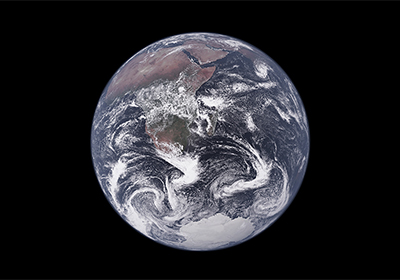

Hoy hace cincuenta años, los astronautas del Apolo 17, la última misión tripulada de la
NASA a la Luna, tomaron una fotografía icónica de nuestro planeta. La imagen se conoció
como la Canica Azul: la primera fotografía de la Tierra totalmente iluminada, en color,
tomada por una persona.

Ahora, los científicos han recreado esa imagen (arriba) durante una prueba de un modelo
climático digital de última generación. El modelo puede simular fenómenos climáticos, como
tormentas y remolinos oceánicos, con una resolución de 1 kilómetro, hasta 100 veces más
nítida que las simulaciones globales habituales.

Para recrear los remolinos de viento de la Mármol Azul -incluido un ciclón sobre el Océano
Índico-, los investigadores introdujeron en el programa informático los registros
meteorológicos de 1972. El mundo resultante captó rasgos distintivos de la región, como las
aguas ascendentes frente a la costa de Namibia y la larga cobertura de nubes en forma de
caña.

Los expertos afirman que esta proeza pone de manifiesto la creciente sofisticación de los
modelos climáticos de alta resolución. Se espera que formen el núcleo del proyecto
Destination Earth de la Unión Europea, cuyo objetivo es crear un &quot;gemelo digital&quot; de la
Tierra para prever mejor los fenómenos meteorológicos extremos y orientar los planes de
preparación.

Para más información, pueden leer el artículo de Science en
https://www.science.org/content/article/supercomputer-re-creates-one-most-famous-pictures-earth