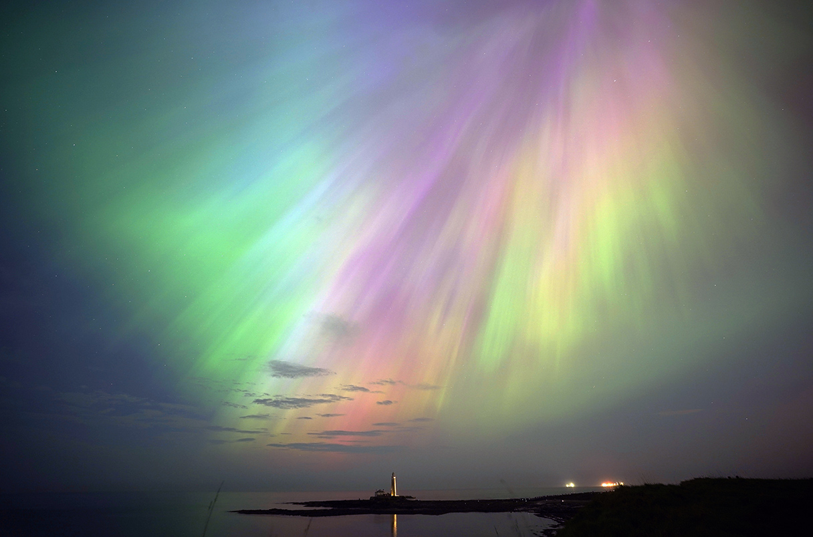

El fin de semana pasado, la Tierra experimentó la mayor tormenta geomagnética en más de dos décadas debido al impacto del Sol. Esta tormenta fue causada por el choque de los campos magnéticos de las burbujas de plasma del Sol con el campo magnético de la Tierra. Además de producir auroras únicas en latitudes tan bajas como los Cayos de Florida, los científicos también quedaron impresionados por su poderosa intensidad.

La Región Activa 3664, un grupo de manchas solares gigantes que era más de 15 veces más ancho que la Tierra, fue el inicio de estos eventos. El campo magnético del Sol en esta región estaba muy concentrado, lo que provocó que las líneas del campo magnético se retorcieran y se rompieran. Esto llevó a que el grupo lanzara hacia la Tierra una serie de enormes manchas de plasma, cada una de ellas con fuertes campos magnéticos.

La detección de al menos cinco de estas eyecciones de masa coronal (CME, por sus siglas en inglés) llevó a los meteorólogos a emitir una alerta G4 "severa" el 9 de mayo. Estas CME no fueron espectaculares individualmente, pero todas se dirigieron hacia la Tierra y se fusionaron en una sola masa compleja a medida que se acercaban. La duración de estos eventos también sorprendió a los científicos, ya que a veces pueden durar hasta siete años.

Los científicos estaban preparados para una tormenta solar, pero no esperaban que fuera tan intensa. Estudiando el comportamiento del Sol, los científicos esperan aprender más sobre estas tormentas y cómo afectan a nuestro planeta. Además, estas tormentas geomagnéticas pueden tener diferentes efectos en la tecnología y las comunicaciones de la Tierra, por lo que entenderlas es importante para proteger nuestras infraestructuras y equipos electrónicos.

En resumen, el fin de semana pasado hubo una tormenta geomagnética intensa provocada por la colisión de los campos magnéticos del Sol y la Tierra. Esta tormenta generó auroras únicas y dejó impresionados a los científicos. La Región Activa 3664 fue responsable de estas eyecciones de masa coronal que se dirigieron hacia la Tierra. Aunque estas CME no fueron especialmente espectaculares individualmente, su fusión y duración prolongada sorprendieron a los científicos. El estudio de estas tormentas es importante para comprender su impacto en nuestro planeta y proteger nuestras infraestructuras tecnológicas.

Para más información, pueden leer el artículo de Science en
https://www.science.org/content/article/extreme-solar-storm-generated-auroras-and-surprise