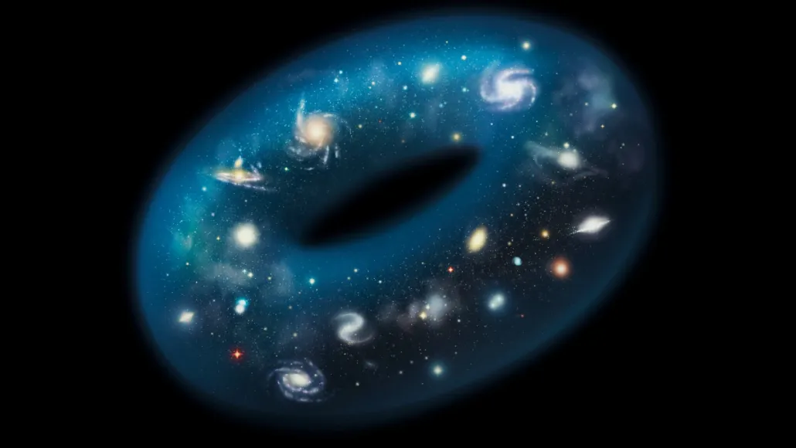

Un nuevo estudio publicado en la revista Physical Review Letters plantea la posibilidad de que el universo tenga una topología análoga a la de una dona. En un universo con esta topología compleja, sería posible viajar por el cosmos y regresar al punto de partida. Aunque se cree que el universo tiene una topología trivial, es decir, que cualquier camino cerrado puede reducirse a un punto, los físicos no descartan la posibilidad de que pueda tener una topología no trivial.

La topología de un objeto describe cómo está conectado y cuántos agujeros tiene. En el caso de una dona, por ejemplo, un bucle que rodea el agujero de la dona no puede reducirse, ya que el agujero limita hasta dónde se puede aplastar. En contraste, en un universo con topología trivial, cualquier camino cerrado dentro del cosmos podría reducirse a un punto. Sin embargo, esta idea sigue siendo teórica y no hay certeza al respecto.

El cosmólogo Dragan Huterer, de la Universidad de Michigan, encuentra fascinante la posibilidad de que el universo pueda tener topologías no triviales y destaca el hecho de que se pueda medir. Según los investigadores, si el universo tuviera una topología no trivial, sería similar a Pac-Man, el icónico juego de arcade. En el juego, si el personaje se desplaza hasta el borde derecho de la pantalla, aparece en el borde izquierdo, como si estuviera conectado en un bucle.

Aunque esta idea de un universo con topología no trivial es intrigante, todavía no hay evidencia empírica que respalde esta teoría. Los científicos continúan investigando y explorando diferentes posibilidades para comprender mejor la estructura y la topología del universo.

Para más información, pueden leer el artículo de TechExplore en
https://www.sciencenews.org/article/universe-geometry-doughnut-physics