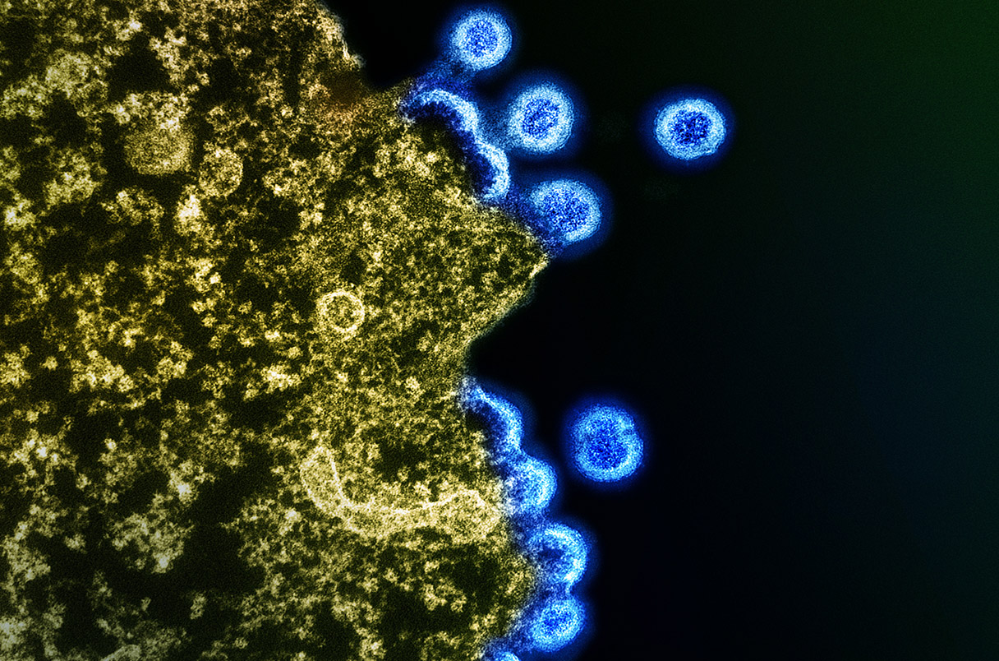

En la Conferencia sobre Retrovirus e Infecciones Oportunistas (CROI), la Dra. Persaud presentó los resultados del seguimiento de 54 recién nacidos infectados con VIH de 11 países diferentes. Estos bebés recibieron tratamiento antirretroviral (ART) estándar dentro de las 48 horas posteriores al nacimiento. De estos, seis niños, todos residentes en países subsaharianos africanos, mostraron las mejores respuestas al tratamiento. Sorprendentemente, después de un seguimiento de al menos 48 semanas, cuatro de estos niños permanecieron en remisión, lo que significa que no tenían virus detectable en sus sistemas mediante las pruebas más sensibles disponibles.

Aunque los resultados son alentadores, es importante destacar que no se consideran curas definitivas. Sin embargo, estos hallazgos sugieren que el tratamiento temprano con ART podría tener un impacto significativo en la gestión de la infección por VIH en los recién nacidos. Además, brindan esperanza para futuras estrategias de tratamiento y cura tanto en niños como en adultos.

La Dra. Persaud enfatiza que estos resultados representan un paso importante en la comprensión de cómo abordar la infección por VIH en la población pediátrica. Si bien aún se necesita más investigación para comprender completamente estos fenómenos y desarrollar enfoques más efectivos, estos hallazgos ofrecen una visión prometedora para el manejo y tratamiento del VIH en los niños.

El estudio de la Dra. Persaud también destaca la importancia de la detección temprana y el tratamiento oportuno del VIH en mujeres embarazadas y recién nacidos. A pesar de los avances en la prevención de la transmisión vertical del VIH, aún hay desafíos por superar en términos de acceso a la atención médica y los servicios de salud en comunidades vulnerables, especialmente en países con recursos limitados.

En resumen, los resultados presentados por la Dra. Persaud en la CROI brindan una perspectiva alentadora sobre el tratamiento del VIH en los recién nacidos y resaltan la importancia de la investigación continua y la colaboración internacional en la lucha contra esta enfermedad. Aunque aún queda mucho por hacer, estos avances representan un paso significativo hacia una mejor comprensión y manejo del VIH en la población pediátrica.

Para más información, pueden leer el artículo de Science en
https://www.science.org/content/article/can-babies-infected-hiv-be-cured-new-study-offers-cautious-optimism
