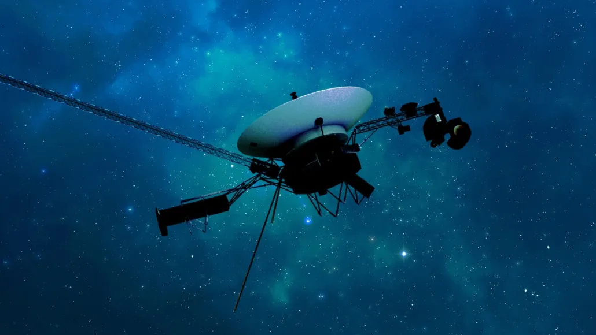

La nave espacial Voyager 1, que se encuentra a unos 24.000 millones de kilómetros de la Tierra, ha vuelto a establecer comunicación después de meses de interrupción. En noviembre pasado, la sonda comenzó a transmitir datos confusos, pero el 20 de abril los científicos de la NASA lograron solucionar un fallo en la memoria del ordenador de a bordo cargando un nuevo software de vuelo. Ahora están recibiendo datos sobre la salud de la nave y esperan que los instrumentos científicos también vuelvan a estar en funcionamiento en las próximas semanas.

La Voyager 1 fue lanzada en 1977 y ha visitado Júpiter y Saturno antes de abandonar el sistema solar. Junto con su gemela, la Voyager 2, son las sondas espaciales más antiguas en funcionamiento y están estudiando las partículas solares y los rayos cósmicos en el espacio interestelar. Han estado monitoreando los cambios en el campo magnético del sol y la densidad del plasma más allá del sistema solar, proporcionando información valiosa sobre los límites de la influencia solar.

La directora del proyecto de la misión, Suzanne Dodd, destaca la longevidad de la nave espacial y su importancia para tener un registro temporal de los cambios en el espacio interestelar. En este sentido, quieren que las Voyager sigan funcionando el mayor tiempo posible.

Estas sondas hicieron historia al cruzar la heliopausa en 2012 (Voyager 1) y 2018 (Voyager 2). La heliopausa es la región donde el viento solar se ralentiza y se encuentran con el medio interestelar. Con su capacidad para comunicarse nuevamente con la Tierra, la Voyager 1 podría continuar su exploración del espacio interestelar y proporcionar más datos sobre los confines del sistema solar.